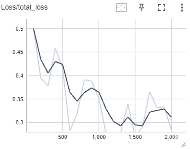

# Problem

This write up is part of the object detection project of the Udacity Nano Degree. In this particular project I tested 3 different CNNs to detect different objects in an urban environment using a forward facing camera on top of a car:
* EfficientDet D1
* Faster RCNN Resnet152 FPN
* SSD MobileNet V2 FPNLite

The objects classes to detect in each frame are:
* Cars
* Pedestrians
* Cyclists

# Results

In the table below we can find the mean average precision (mAP) for each of the aforementioned CNNs as well as their loss and learning rates over time. Given these results the MobileNet V2 performed the best during my testing. This can be seen because it sports the highest mAP values in almost all categories except for medium sized objects where the Faster RCNN with a Resnet152 performs better. One note on this is that a different learning rate was used for the MobileNet which might influence the outcome of this experiment. The data augmentation was kept to a minimum as it doesn't influence the results give the small amount of training steps.

|  | EfficientDet D1 | Faster RCNN Resnet152 FPN | SSD MobileNet V2 FPNLite |
| ---- | ---- | ---- | ---- |
| **mAP** | 0.059 | 0.069 | **0.085** |
| **mAP, IoU=0.5** | 0.160 | 0.149 | **0.190** |
| **mAP, IoU=0.75** | 0.026 | 0.060 | **0.070** |
| **mAP (small)** | 0.027 | 0.025 | **0.032** |
| **mAP (medium)** | 0.264 | **0.317** | 0.304 |
| **mAP (large)** | 0.191 | 0.230 | **0.324** |
| **Total Loss After 2000 Steps Graph** |  |  |  |
| **Learning Rate** |  |  |  |
| **Optimizer** | Momentum GD | Momentum GD | Momentum GD |
| Augmentations | - Horizontal Flip - Scale crop and pad to square | - Horizontal Flip - Scale crop and pad to square | - Horizontal Flip |

In the GIF below we can see the result of the best performing CNN MobileNet V2. The CNN performs extremely well given the very small amount of training steps.

    

# Improvements

There are many things that can be improved:
* Increase the number of training steps
* Add image augmentations
* Train the CNNs for different scenarios like:
	* Nighttime
	* Complex European street environments
* Train different types of CNNs and compare their performance
* Hyper-parameters training